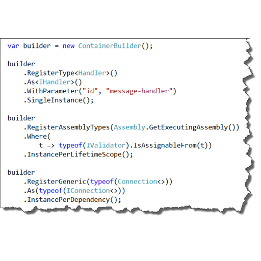

	

		

			
			

				

					<h1>Autofac</h1>
					
Autofac is an addictive <a href="http://martinfowler.com/articles/injection.html">Inversion of Control container</a> for .NET 4.5, Silverlight 5, Windows Store apps, and Windows Phone 8 apps.

					
<a href="https://code.google.com/p/autofac/wiki/GettingStarted" class="btn btn-primary btn-large">Get Started &raquo;</a>

				

			

		

		

			
			

				

					<h1>Got a Question?</h1>
					
We're here to help! The Autofac community is active on <a href="http://stackoverflow.com/questions/tagged/autofac">StackOverflow</a> as well as <a href="https://groups.google.com/forum/#forum/autofac">the Google Group for Autofac Users</a>.

					
<a href="http://stackoverflow.com/questions/tagged/autofac" class="btn btn-primary btn-large">Ask a Question &raquo;</a>

				

			

		

		

			
			

				

					<h1>Easy Integration</h1>
					
Autofac has integration for many .NET application types, all just a couple of NuGet references away... <em>and we'll even write the script for you!</em>

					
<a href="/scriptgen/" class="btn btn-primary btn-large">Get a NuGet Script &raquo;</a>

				

			

		

	

	<a class="carousel-control left" href="#heroCarousel" data-slide="prev">&lsaquo;</a>
	<a class="carousel-control right" href="#heroCarousel" data-slide="next">&rsaquo;</a>

	

		

			<h2>Download</h2>
			
The easiest way to get Autofac is through NuGet. We can <a href="/scriptgen/">generate a NuGet script for you</a> or you can <a href="https://nuget.org/packages?q=Author%3A%22Autofac+Contributors%22+Owner%3A%22alexmg%22+Autofac*">go through the NuGet Gallery</a>.

			
If you're not into NuGet, you can also <a href="https://code.google.com/p/autofac/downloads/list">download the packages in zip archives</a>.

			
<a class="btn" href="/scriptgen/">Install via NuGet &raquo;</a>

		

		

			<h2>Learn</h2>
			
If you're new to Autofac, <a href="https://code.google.com/p/autofac/wiki/GettingStarted">the Quick Start guide</a> is a good place to start learning about how to use Autofac.

			
For more detailed information, <a href="https://code.google.com/p/autofac/w/list">check out the Autofac wiki</a>, where Autofac features and examples are shown more in depth, or jump to <a href="/apidoc/">the API documentation</a>.

			
And if you have a question? Hit us up on <a href="http://stackoverflow.com/questions/tagged/autofac">StackOverflow</a>.

			
<a class="btn" href="https://code.google.com/p/autofac/wiki/GettingStarted">Quick Start &raquo;</a>

	   

		

			<h2>Get Involved</h2>
			
Been using Autofac and found something amiss? You can let us know by <a href="https://code.google.com/p/autofac/issues/list">filing an issue</a>.

			
Want to help us improve Autofac and fix those issues? Even better. <a href="https://code.google.com/p/autofac/source/browse/">Check out the source</a> and our <a href="https://code.google.com/p/autofac/wiki/ContributionGuidelines">contributor's guide</a>, and drop us a line on <a href="https://groups.google.com/forum/#forum/autofac">the discussion forum</a>!

			
<a class="btn" href="https://code.google.com/p/autofac/">Google Code Site &raquo;</a>

		

	

	

	

		
		<h2 class="featurette-heading">Fluent syntax. Build complex registrations with ease.</h2>
		
Defining your component registrations is simple with the flexible fluent syntax Autofac provides.

		
<a href="https://code.google.com/p/autofac/wiki/ComponentCreation" class="btn btn-primary btn-large">Learn about component registration &raquo;</a>

	

	

	

		
		<h2 class="featurette-heading">Flexible configuration system. XML or code - your call.</h2>
		
Strike a balance between the deployment-time benefits of XML configuration and the clarity of code with Autofac modules.

		
<a href="https://code.google.com/p/autofac/wiki/XmlConfiguration" class="btn btn-primary btn-large">Dive into configuration &raquo;</a>

	

	

	

		
		<h2 class="featurette-heading">Added functionality through Extras. Go beyond standard integration.</h2>
		
Support for multitenant dependency injection, aggregate services, automatic dynamic proxy wire-up, Enterprise Library integration, and more through the Autofac.Extras extension projects.

		
<a href="https://code.google.com/p/autofac/wiki/NuGetPackages" class="btn btn-primary btn-large">See the full list &raquo;</a>

	

	

	<footer>
	
&copy; Autofac Contributors 2013

	</footer>

